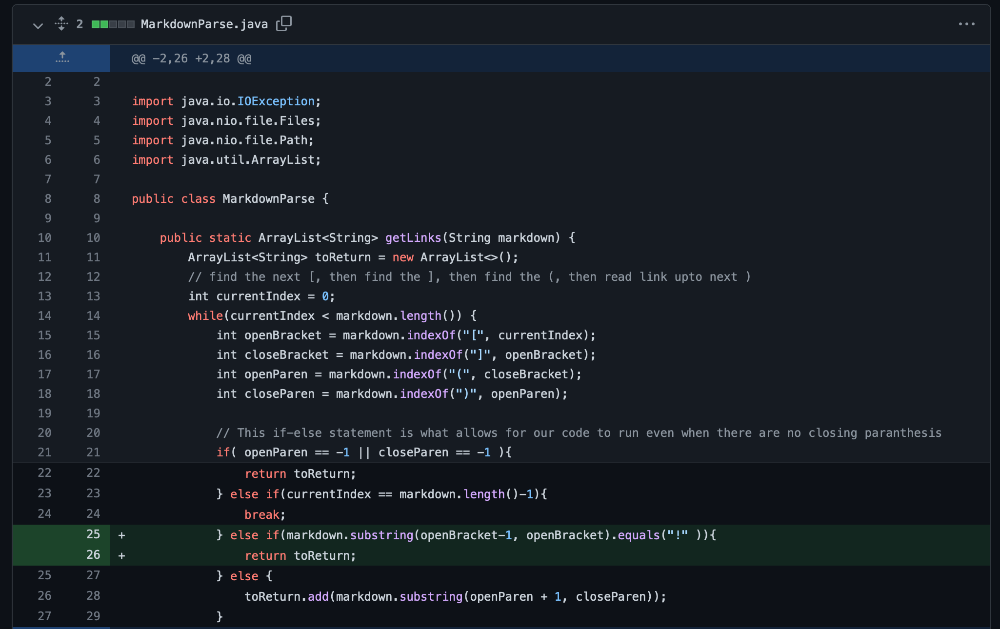

# CSE15L Lab report 2 | Week 4
```
Written and Submitted by: Billy Phan
```
---

```Code Change 1```

> First Code Diff: 


*See why we needed to make this change here:*
[Failure Inducing Symptom 1](https://github.com/b-ianphan/markdown-parser/blob/main/breakingTest1.md)

> Output of Symptom:


> Explanation: 

My code prior to fixing was essentially reading the index of `Closing Parenthesis: ")"` as "-1" (it couldn't be found), so when our program would take note of a link using `.add` there would be an `indexOutOfBoundsException` (the symptom). This output only occurs when we pass to our program a `.md` file where we have a open paranthesis without a paired closing one `Ex: [...](...`.

---

```Code Change 2```

> Second Code Diff:


*See why we needed to make this change here:* [Failure Inducing Symptom 2](https://github.com/b-ianphan/markdown-parser/blob/main/breakingTest2.md)

> Output of Sympton: 


> Explanation:

My code prior to fixing was essentially getting to the end of a testing `.md` file, however, wasnt able to find a 
" [ ", " ] ", " ( ", or " ) ". Because it was unable to find anything, our `currentIndex` value could not be incremented to a value larger or equal to our `file (string) size` since there were no other links provided after the empty space in the file our while loop could not terminate, and thus, continously took up heap space. 

--- 

```Code Change 3```

> Third Code Diff:



*See why we needed to make this change here:* [Failure Inducing Symptom 3](https://github.com/b-ianphan/markdown-parser/blob/main/breakingTest3.md)

> Output of Sympton:


> Explanation:

My code was mistakingly taking an image source and returning it as a "link". Despite the wording inbetween my `()`, actually resembling a link, this is an incorrect output since I gave my `.md` a command to insert an image (``)

---

```All three files working```

Although this was not asked for in the lab report I've decided to include an image which illustrates my code running for all three `.md files`.


